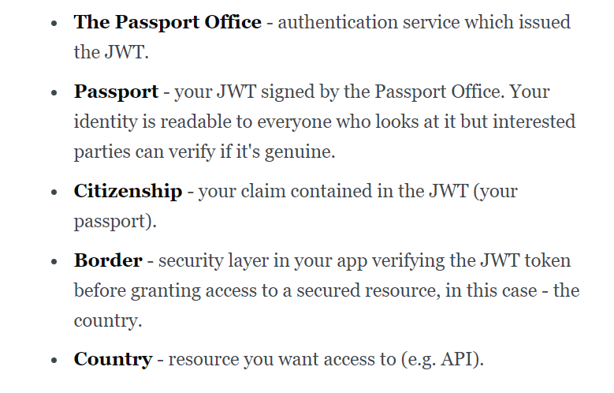
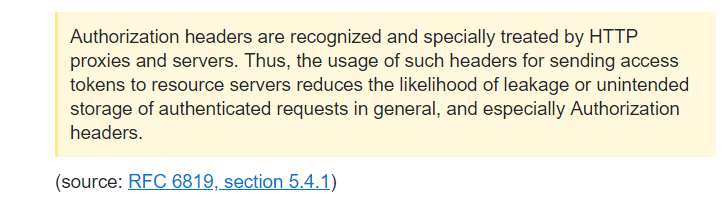

### sessions vs jwt vs oauth(2) vs Passport.js

Authentication system
  * allows a user to access a resource only when user's identity is
  confirmed, e.g. by comparing the supllied credentials are compared
  with that stored in the database.

  * can be session-based or token-based. 
  
  * in other words, verify user's identity when they login,
  use either a cookie, a JWT, etc.

## Session (Cookie) - based authentication vs Token-based authentication

Sessions
  > aka. session-based authentication

	often involves **cookies**
	- hence: cookie-based authentication, same as session-based

	The difference:
	- `express-session` vs `cookie-session`

  * makes use of a cookie stored in user's browser
	
	* used in __Traditional Web Apps__ (vs __Web APIs__ that use token-based)
    
JWT 
  > aka token-based authentication

	TL;DR
	> a token format, it defines a compact and self-contained mechanism for transmitting data between parties in a way that can be verified and trusted because it is digitally signed
	> and since it's JSON-encoded, it is lightweight and easily used within context of HTTP
	> perfect for implementing stateless authentication, making it a 
	__bearer token__ (in the context of OAuth 2)

  * JWT is a signed piece of data in JSON format, and since it's signed, 
    the recipient can verify its authenticity
  * weighs very little since it's JSON
  * sent along with every request
  * can be used for truly RESTful (stateless), i.e. no sessions
		* i.e. no need to keep session data in the server to auth. user
	
	* Analogy: 
		* 
	
	* How it works:
		1. User (via client) calls auth. service, sending username and password
		2. Auth service (backend) responds with a signed JWT, which says who the user is
			 * The client stores the token somehow (e.g. memory, localStorage)	 
		3. User (via client) requests access to a secured service, sending the JWT back
			 * Usually, token is sent as a: 
			 	 a. cookie, or 
				 b. `Authorization` header in HTTP request, __more preferred for security reasons (CSRF)__

				

				c. 	
				 > Cookies would be susceptible to CSRF, unless CSRF tokens were used
				 > Cookies can be sent back only to the same domain they were issued from
				  _if auth service resides on a diff domain, it could get hairy_
		4. Security layer (backend) checks signature on the token, 
			grants access if verified genuine
		5. Logging out is the client's responsibility - which happens as soon as the client forgets the token
				* if it doesn't have token (or if token expires), it cannot be authorized
				making it officially _logged out_

				> vs sessions were date is stored on the service side

	 * With this:
	 	* No session storage needed
		* No garbage collection for sessions 
			* JWT carry its own expiry date
		* truly RESTful service since stateless
			* JWT is so small that it can be sent with each request like a session cookie
			* Unlike session cookie though: __it does not point to any data on server__
				JWT has all the data in itself

		* JWT is either JWE or JWS
			* The claims (i.e. auth data) is encoded as JSON and used as a payload of JWS or JWE

			* JWE offers encryption, so only someone with a key can decrypt it
			* JWS is simpler, which we'll use here

		* inside JWT/JWS
			- Header - info about signing algorithm, type of payload (JWT), etc in JSON
			- Payload - actual data (claims) in JSON
			- Signature

## Mixing token-based with cookie-based ?

https://auth0.com/docs/design/web-apps-vs-web-apis-cookies-vs-tokens

OAuth2
- an auth. protocol (spec) that relies on:
	* `Authorization` HTTP Header
	* using the `Bearer` authentiaction scheme

- it could use JWT as a token format

- vs. JWT (which is just a format)
	* JWT is not a standard and does not specify *how* the Client obtains the token in the first stage
	* Oauth is more complex, since it defines various ways in which Client can obtain access token from an "Auth Server"

- more flexible than older OAuth
	* support for non-browser clients
	* doesn't require clients to have cryptography

OAuth (older version)
	- uses server-side and client-side storage

	- key differences of Oauth vs Oauth2:
		https://stackoverflow.com/questions/4113934/how-is-oauth-2-different-from-oauth-1

		https://hueniverse.com/introducing-oauth-2-0-b5681da60ce2

Passport.js
	* auth library that provides different *strategies*, including JWT
	* strategies include `passport-jwt`, `passport-facebook`, `passport-google-auth`, `passport-github`

	* note that you can implement these strategies independently, but Passport.js makes it easier and allows you to combine different strategies within an auth. service	

reference:

https://float-middle.com/json-web-tokens-jwt-vs-sessions/

https://stackoverflow.com/questions/39909419/what-are-the-main-differences-between-jwt-and-oauth-authentication

https://auth0.com/docs/design/web-apps-vs-web-apis-cookies-vs-tokens
