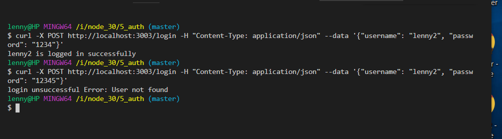
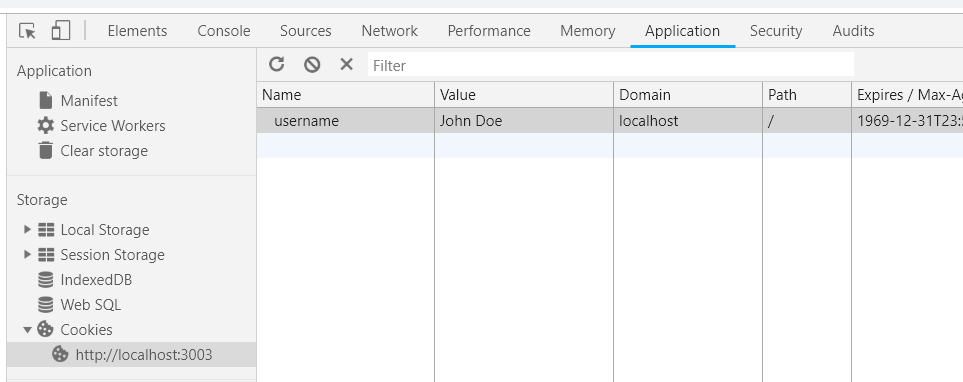

*`> mongo.exe`*

```
> show dbs
OAuthTest  0.000GB
admin      0.000GB
foodblog   0.000GB
local      0.000GB
mapmatch   0.000GB
>
> show dbs
OAuthTest  0.000GB
admin      0.000GB
auth_test  0.000GB
foodblog   0.000GB
local      0.000GB
mapmatch   0.000GB
> use auth_test
switched to db auth_test
> db.users.find()
{ "_id" : ObjectId("5c3a404d0b1097c724fd2fcd"), "email" : "lenny@user.com", "username" : "lenny", "password" : "1234", "passwordConf" : "1234", "__v" : 0 }
```

## bcrypt - hash password with a salt

## express-session

- creates a session middleware with given options
* Session data is not saved in the cookie itself,
but stored server-side


**login/ - compare input password with stored hashed password **




**Login, Register Views**


========================================================

# EXTRAS

## cookies vs local storage vs session storage

## cookies

regular cookies in the browser

in console: 
`document.cookie = "username=John Doe"`
* this is not persisted between refreshes


## local storage 
`localStorage.setItem('name', 'lenny')`
-> refresh, close/open tab, duplicate tab
`localStorage.getItem('name')		// lenny`


