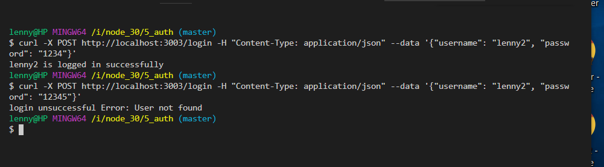
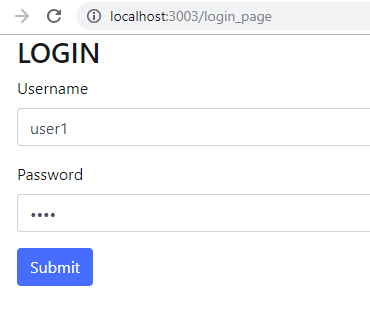
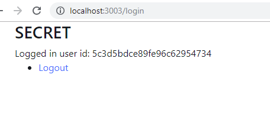
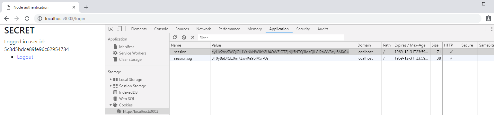
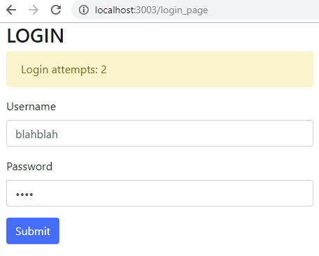
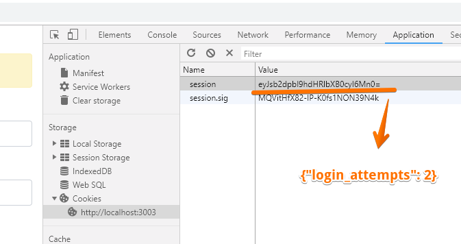
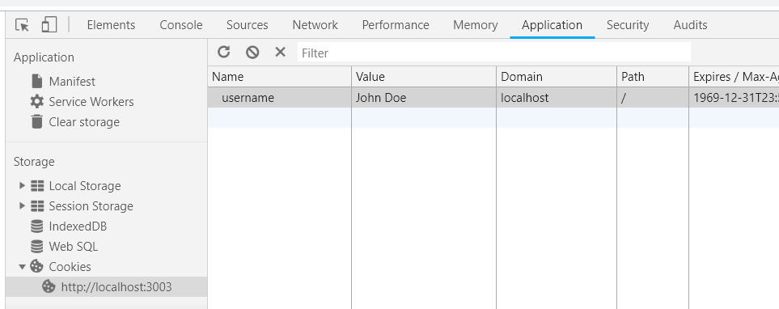

*`> mongo.exe`*

```
> show dbs
OAuthTest  0.000GB
admin      0.000GB
foodblog   0.000GB
local      0.000GB
mapmatch   0.000GB
>
> show dbs
OAuthTest  0.000GB
admin      0.000GB
auth_test  0.000GB
foodblog   0.000GB
local      0.000GB
mapmatch   0.000GB
> use auth_test
switched to db auth_test
> db.users.find()
{ "_id" : ObjectId("5c3a404d0b1097c724fd2fcd"), "email" : "lenny@user.com", "username" : "lenny", "password" : "1234", "passwordConf" : "1234", "__v" : 0 }
```

## bcrypt - hash password with a salt

**login/ - compare input password with stored hashed password **




**Login, Register Views**






## express-session

- creates a session middleware with given options
- only uses cookies for `session_id`
* Session data is not saved in the cookie itself,
but stored server-side (more secure)

- This module directly reads and writes cookies on req/res
- **MORE ABSTRACT**
- let's try to use simpler cookie-based auth

## cookie-session

```
// > cookie-session
app.set('trust proxy', 1) // trust first proxy
app.use(cookieSession({
  name: 'session', 
  secret: 'secret_key',         // use 1 secret or keys array
  // keys: ['key1', 'key2'],    // always use keys[0] for signing cookies, others are used for verification
  httpOnly: true,   // false allows access using `document.cookie` but is not secure
}));

```

cookies set in the browser side, includes `session_id` and some data
(less secure)



the values are base-64ed

session: `{"userId":"5c3d5bdce89fe96c62954734","views":1}`
	- userId is the User _id from mongo

session.sig: (unreadable) signature generated using the key ('secret_key')
	to prevent tampering


ref: https://stackoverflow.com/questions/46859103/how-can-i-access-cookie-session-from-client-side


**adding num of views for logged-in user**

**H. tracking number of unsuccessful attempts**



all session data stored in cookies (since we're using `cookie-session`)



========================================================

# EXTRAS

## simpler session-based auth, without

https://www.codementor.io/mayowa.a/how-to-build-a-simple-session-based-authentication-system-with-nodejs-from-scratch-6vn67mcy3


## cookies vs local storage vs session storage

## cookies

regular cookies in the browser

in console: 
`document.cookie = "username=John Doe"`
* this is not persisted between refreshes


## local storage 
`localStorage.setItem('name', 'lenny')`
-> refresh, close/open tab, duplicate tab
`localStorage.getItem('name')		// lenny`


## FURTHER reading:

express-session: better than cookie-session
https://www.npmjs.com/package/express-session

Different types of auth

https://softwareengineering.stackexchange.com/questions/350092/cookie-based-vs-session-vs-token-based-vs-claims-based-authentications


Templating using EJS

https://scotch.io/tutorials/use-ejs-to-template-your-node-application


Security risks of using `body-parser` and avoiding CSRF

https://fosterelli.co/dangerous-use-of-express-body-parser.html'


Basic auth with Node and mongodb

https://medium.com/createdd-notes/starting-with-authentication-a-tutorial-with-node-js-and-mongodb-25d524ca0359