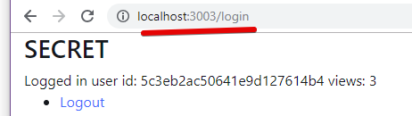

[ ] allow both JSON and form inputs in /login, /register routes

[/] block /secret_page when not logged in

	Options:

	- [G] check session.userId on `/secret_page`, 
			render `secret` if set, 
			else render `login`

	- [I] use middleware to require login, like used here: https://medium.com/createdd-notes/starting-with-authentication-a-tutorial-with-node-js-and-mongodb-25d524ca0359

	- [G] don't show `user_id` to prevent page load error

	- 

[G] - URL is /login, even though in SECRET page

[H] - track number of unsuccesful login attemtps

[ ] - use templates for the Navbar, and include in all pages

[ ] - user express-session instead of cookie-session, and verify that no session data is sent to the browser

LEVEL 2 - OAuth (might be better to put in a separate folder/ file)

[ ] - cleanup / or make separate folder for src / or different strategies, all managed in code

[ ] - Oauth client
	-> authenticating web app by connecting to popular social media sites

[ ] - Oauth server
	-> https://blog.cloudboost.io/how-to-make-an-oauth-2-server-with-node-js-a6db02dc2ce7

[ ] - sessions vs jwt vs passport.js

sessions - classic way

jwt - 

passport - provides different strategies (jwt, oauth - github, google, etc)
