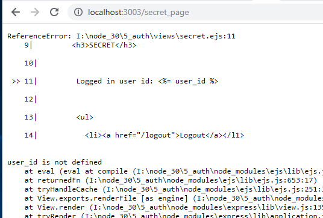
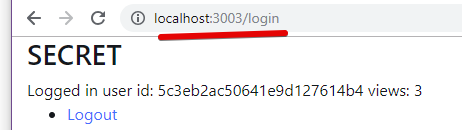

[ ] allow both JSON and form inputs in /login, /register routes

[-] block /secret_page when not logged in

	Options:

	- [G] check session.userId on `/secret_page`, 
			render `secret` if set, 
			else render `login`

	- [ ] could use `requiresLogin` middleware here: https://medium.com/createdd-notes/starting-with-authentication-a-tutorial-with-node-js-and-mongodb-25d524ca0359

	- [ ] don't show `user_id` to prevent page load error

	- 

[G] - URL is /login, even though in SECRET page

[H] - track number of unsuccesful login attemtps

