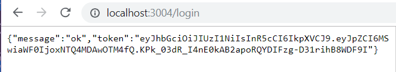
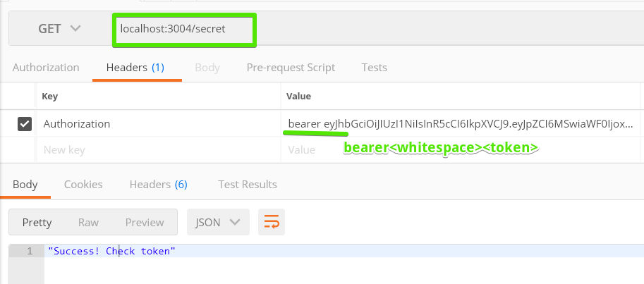

BACKEND
send JWT along with every request to the API
no sessions

FRONTEND
no cookies
can save JWT in localStorage

`npm install passport passport-jwt jsonwebtoken`

Passport.js
- works with the concept of strategies,
which is a middleware function that a 
request runs through before getting to the actual route
- if strategy fails (callback called with an error that is not `null` or `false`), the route will not be called
but a __401 Unauthorized__ response sent

`ExtractJwt.fromAuthHeaderAsBearerToken()`
- can replace with other extraction methods, or even write your own
https://github.com/themikenicholson/passport-jwt

### working !!! ###

User log-in, gets token

Use token to authenticate access to /secret page

